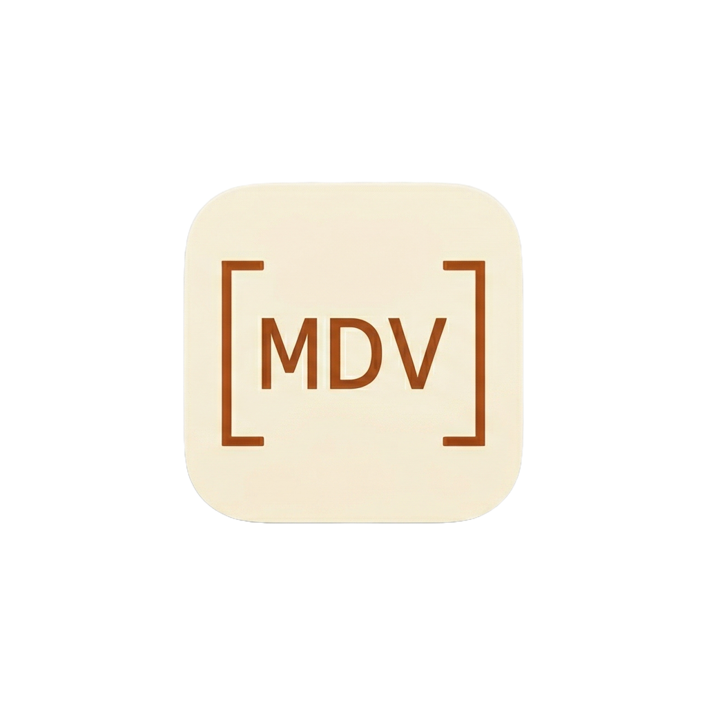

<p align="center">
  
</p>

<h1 align="center">MDV</h1>

<p align="center">
  A native macOS markdown editor with live syntax highlighting and a clean reading experience.
</p>

<p align="center">
  <a href="https://github.com/jayl930/MDV/releases/latest">Download</a>
</p>

---

## What is MDV?

MDV is a lightweight markdown editor for macOS that renders syntax inline as you type. There's no split pane or preview toggle — you edit and read in the same view. Markdown symbols hide when you move your cursor away, giving you a distraction-free writing surface.

## Features

### Editor
- **Inline syntax highlighting** — headings, bold, italic, strikethrough, code, links, and block quotes render in place
- **Syntax marker hiding** — `#`, `*`, `` ` `` and other markers disappear when the cursor leaves the line
- **Inline table editing** — tables render as styled grids with right-click to add/remove rows and columns
- **Keyboard shortcuts** — `Cmd+B` bold, `Cmd+I` italic, `Cmd+K` link

### Navigation
- **Table of contents sidebar** — auto-generated from headings, toggle with `Cmd+Shift+T`
- **Click-to-navigate** — jump to any section from the TOC

### Markdown Support
- Headings (H1–H6)
- Bold, italic, bold-italic, strikethrough
- Inline code and fenced code blocks
- Links with clickable rendering
- Ordered and unordered lists
- Block quotes
- Tables (GFM pipe syntax)
- Horizontal rules

### Appearance
- **Light, Dark, and System** themes with warm, balanced color palettes
- Adjustable font size (12–24pt)
- Adjustable content width (500–1000pt)

### QuickLook Extension
Preview markdown files directly in Finder without opening the app.

### Auto-Updates
Built-in update checking via Sparkle with EdDSA-signed releases.

## File Types

`.md` `.markdown` `.mdown` `.mkd`

## Requirements

macOS 14.0 Sonoma or later.

## Install

1. Download `MDV-x.x.dmg` from [Releases](https://github.com/jayl930/MDV/releases/latest)
2. Drag **MDV.app** to **Applications**
3. Open MDV

## Build from Source

```bash
git clone https://github.com/jayl930/MDV.git
cd MDV
xcodebuild -scheme MDV -configuration Release
```

Requires Xcode 16+ and Swift 5.

## Tech Stack

- **SwiftUI** + **AppKit** (NSTextView with NSLayoutManager for rendering)
- **Apple Swift Markdown** for parsing
- **Sparkle** for auto-updates
- **Core Text** for font handling and CJK support

## License

[MIT](LICENSE)
